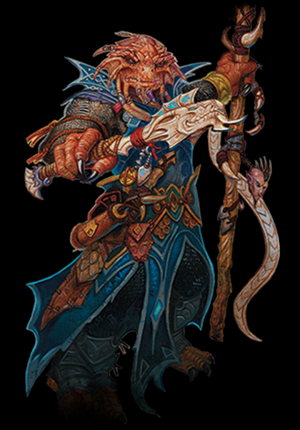
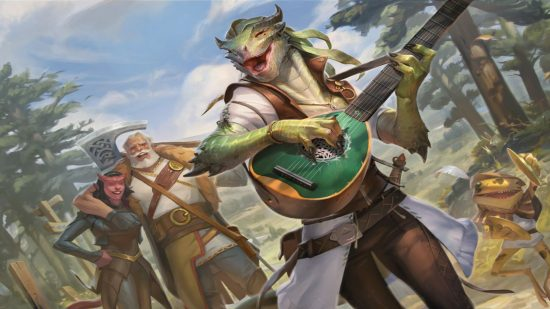

# Draconato

## Caracteristicas draconato
*Aumento no Valor de Habilidade*: Seu valor de Força aumenta em 2 e seu valor de Carisma aumenta em 1.   

*Idade*: Draconatos jovens crescem rapidamente. Eles caminham horas após nascerem, adquirindo o tamanho e desenvolvimento semelhante a de uma criança humana de 10 anos com 3 anos de idade e alcançam a maturidade aos 15. Eles costumam viver até os 80.  

*Tendência*: Os draconatos tendem aos extremos, realizando uma escolha consciente de um lado ou do outro da guerra cósmica entre o bem e o mal (representada por
Bahamut e Tiamat, respectivamente). A maioria dos draconatos é boa, mas os que vão para o lado de Tiamat podem se tornar vilões terríveis.  

*Tamanho*: Os draconatos são mais altos e mais pesados que os humanos, geralmente possuindo mais de 1,80 metro e normalmente pesando mais de 125 kg. Seu tamanho é Médio. 

*Deslocamento* Seu deslocamento base de caminhada é 9 metros.  

*Ancestral Dracônico*: Você possui um ancestral dracônico. Escolha um tipo de dragão da tabela Ancestral Dracônico. Sua arma de sopro e resistência a dano são
determinadas pelo tipo de dragão, como mostrado na tabela.  

*Arma de Sopro*: Você pode usar uma ação para exalar energia destrutiva. Seu ancestral dracônico determina o tamanho, formado e tipo de dano que você expele.
Quando você usa sua arma de sopro, cada criatura na área exalada deve realizar um teste de resistência, o tipo do teste é determinado pelo seu ancestral dracônico. A CD do teste de resistência é 8 + seu modificador de Constituição + seu bônus de proficiência. Uma criatura sofre 2d6 de dano num fracasso e metade desse dano num
sucesso. O dano aumenta para 3d6 no 6° nível, 4d6 no 11° nível e 5d6 no 16° nível.
Depois de usar sua arma de sopro, você não poderá utilizá-la novamente até completar um descanso curto ou longo.

*Resistência a Dano*: Você possui resistência ao tipo
de dano associado ao seu ancestral dracônico.  

*Idiomas*: Você pode falar, ler e escrever Comum e Dracônico. O idioma Dracônico é conhecido por ser uma das mais antigas línguas e ainda é usado no estudo de magia. A linguagem soa áspera para a maioria das criaturas, incluindo várias consoantes e silabas firmes. 

ANCESTRAL DRACÔNICO

| Dragão | Tipo de Dano | Arma de Sopro |  
| ------ | ------------ | ------------- |
| Azul |Elétrico |Linha de 1,5m/9m (teste de Des)|
| Branco |Frio | Cone de 4,5m (teste de Con)|
| Bronze |Elétrico | Linha de 1,5m/9m (teste de Des)|
| Cobre |Acido |Linha de 1,5m/9m (teste de Des)|
| Latão |Fogo |Linha de 1,5m/9m (teste de Des)|
| Negro |Acido |Linha de 1,5m/9m (teste de Des)|
| Ouro |Fogo |Cone de 4,5m (teste de Des)|
| Prata |Frio |Cone de 4,5m (teste de Con)|
| Verde |Veneno |Cone de 4,5m (teste de Con)|
| Vermelho |Fogo |Cone de 4,5m (teste de Des)|

  
  

## Origens e Cidades

Os draconatos nâo sao originarios do planeta de Toril e sim do seu planeta gemeo Abeir. Durante a Spellplague, draconatos foram enviados de Abeir para Toril, a maioria deles vive no continente de Laerakond. Em Faerûn, a maioria dos draconatos reside na nação militarista de [Tymanther](../nations/Tymanther.md).