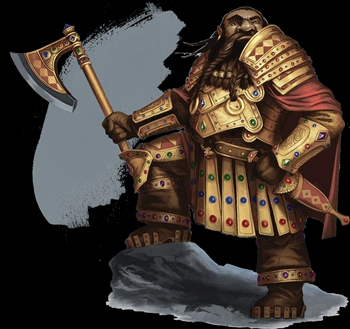
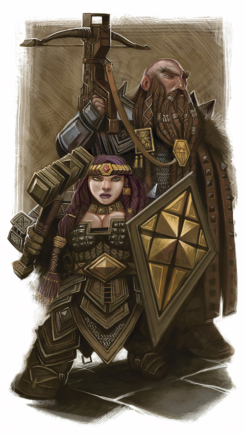
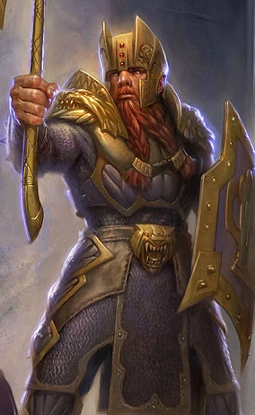
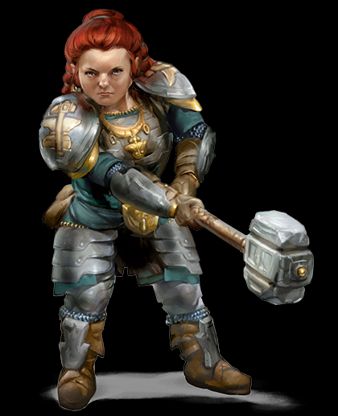
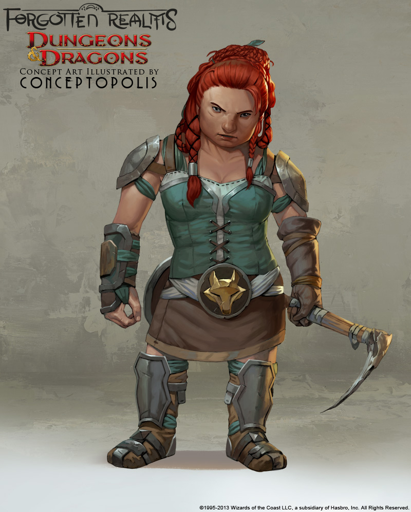

# Anão

## TRAÇOS RACIAIS DOS ANÕES
Um personagem anão possui uma variedade de habilidades inatas, parte integrante a natureza dos anões.  

*Aumento no Valor de Habilidade*: Seu valor de Constituição aumenta em 2.

*Idade*: Anões tornam-se maduros na mesma proporção que os humanos, mas são considerados jovens até atingirem a idade de 50 anos. Em média, eles vivem 350 anos.  
*Tendência*: A maioria dos anões é leal, pois acreditam firmemente nos benefícios de uma sociedade bem organizada. Eles tendem para o bem, com um forte senso
de honestidade e uma crença de que todos merecem compartilhar os benefícios de uma ordem social justa.  

*Tamanho*: Anões estão entre 1,20 e 1,50 metro de altura e pesam cerca de 75 kg. Seu tamanho é Médio. Deslocamento. Seu deslocamento base de caminhada é de 7,5 metros. Seu deslocamento não é reduzido quando estiver usando armadura pesada.   

*Visão no Escuro*: Acostumado à vida subterrânea, você tem uma visão superior no escuro e na penumbra. Você enxerga na penumbra a até 18 metros como se fosse
luz plena, e no escuro como se fosse na penumbra. Você não pode discernir cores no escuro, apenas tons de cinza.

*Resiliência Anã*: Você possui vantagem em testes de
resistência contra venenos e resistência contra dano de
veneno (explicado no capítulo 9).  

*Treinamento Anão em Combate*: Você tem proficiência com machados de batalha, machadinhas, martelos leves e martelos de guerra.

*Proficiência com Ferramentas*: Você tem proficiência em uma ferramenta de artesão à sua escolha entre: ferramentas de ferreiro, suprimentos de cervejeiro
ou ferramentas de pedreiro.

*Especialização em Rochas*: Sempre que você realizar um teste de Inteligência (História) relacionado à origem de um trabalho em pedra, você é considerado
proficiente na perícia História e adiciona o dobro do seu bônus de proficiência ao teste, ao invés do seu bônus de proficiência normal.

*Idiomas*: Você pode falar, ler e escrever Comum e Anão. O idioma Anão é repleto de consoantes duras e sons guturais, e essa característica influencia, como um
sotaque, qualquer outro idioma que o anão falar.

*Sub-raça*: Existem duas sub-raças principais de anões nos mundos de D&D: anões da colina e anões da montanha. Você deve escolher uma dessas sub-raças.
### ANÃO DA COLINA OU ANÃO DO OURO
Como um anão da colina, você tem sentidos aguçados, maior intuição e notável resiliência. Os anões dourados de Faerûn, que vivem em seu poderoso reino ao sul do continente, são anões da colina, assim como os exilados Neidar e os depreciáveis Klar de Krynn, no cenário de Dragonlance.

*Aumento no Valor de Habilidade*: Seu valor de Sabedoria aumenta em 1.

*Tenacidade Anã*. Seu máximo de pontos de vida aumentam em 1, e cada vez que o anão da colina sobe um nível, ele recebe 1 ponto de vida adicional.
  
Os anões de ouro, também conhecidos como anões da colina, originalmente viviam na Grande Fenda, porem apos a Praga Mágica e a queda da [Grande Fenda](../nations/greatRift.md) para o Underdark se dividiram em algumas regioes. 

#### Pátrias
Em contraste com seus irmãos anões do escudo, os anões de ouro mantiveram seu reino, o [Reino Profundo](../nations/deep.md), intacto e forte contra os ataques de outras raças. Anões de ouro também podem ser encontrados nas [Montanhas Fumegantes](../nations/smokingMountains.md), bem como nas [As montanhas da Corrida do Gigante](../nations/giant'sRunMountains.md), a oeste de Vilhon Reach.

  
  

### ANÃO DA MONTANHA OU ANÃO DO ESCUDO
Como um anão da montanha, você é forte e resistente, acostumados a uma vida difícil em terrenos difíceis. Você, provavelmente tem a descendência daqueles mais altos (para um anão) e tende a possuir uma coloração mais clara. Os anões do escudo do norte de Faerûn, bem como o clã governante Hylar e os clãs nobres Daewar de Dragonlance, são anões da montanha.

*Aumento no Valor de Habilidade*: Seu valor de Força aumenta em 2.

*Treinamento Anão com Armaduras*. Você adquire proficiência em armaduras leves e médias. 
  
  
  

#### Pátrias
As terras ancestrais dos anões do escudo estavam localizadas principalmente no norte. Anões do escudo também podem ser encontrados em Damara, Vaasa, the Vast e Western Heartlands. De todas as suas fortalezas, a mais importante era provavelmente a Cidadela Adbar. No entanto, enquanto os anões do escudo mantiveram muitas terras próprias, gerações de emigração pelos Wanderers fizeram com que uma vasta diáspora de anões do escudo se espalhasse pelas terras humanas. Essas comunidades dispersas geralmente se aproximavam de um clã anão tradicional, mantendo seus próprios caminhos enquanto se integravam à comunidade local.

