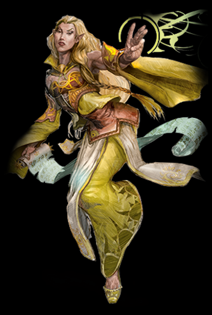
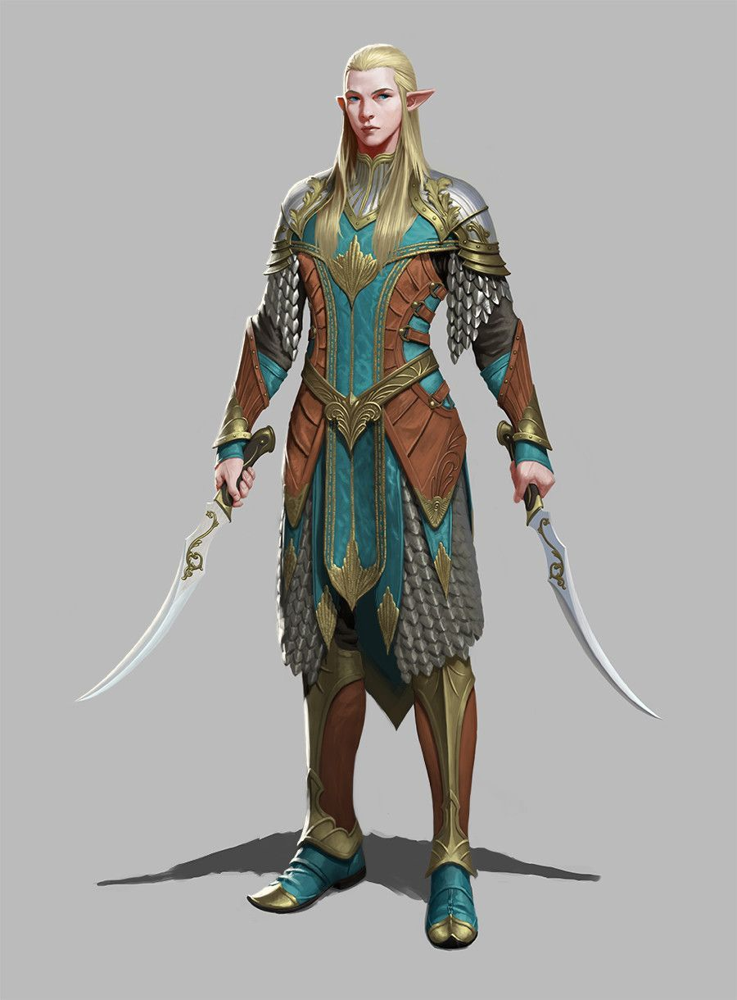
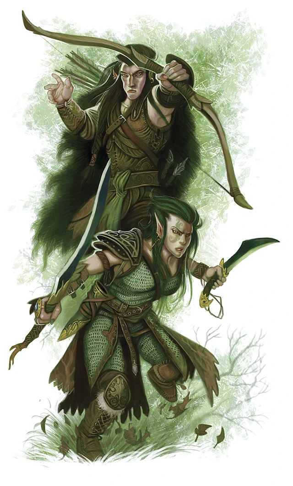
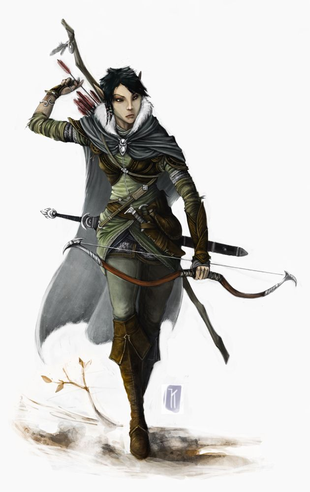
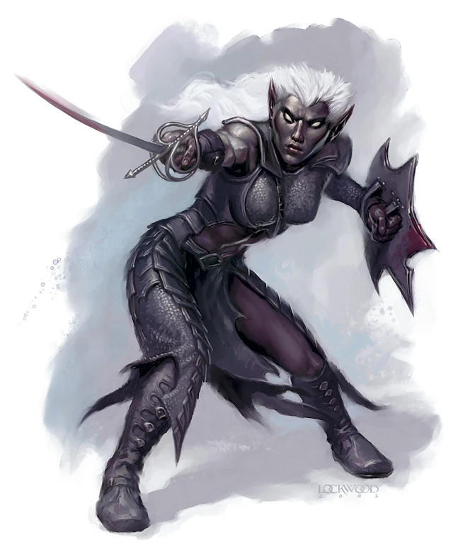
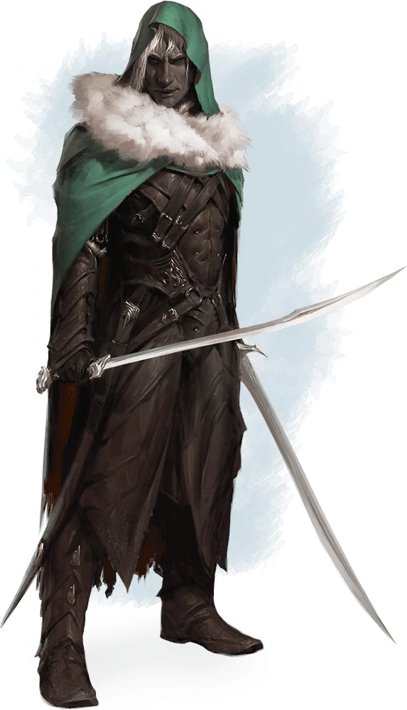

# Elfo

## TRAÇOS RACIAIS DOS ELFOS
Seu elfo tem uma variedade de habilidades naturais, resultado de milhares de anos de refinamento élfico.

*Aumento no Valor de Habilidade*: Seu valor de
Destreza aumenta em 2.

*Idade*: Embora os elfos atinjam a maturidade física com praticamente a mesma idade dos humanos, a compreensão élfica da idade adulta vai além da
maturidade física, abrangendo sua experiência sobre o mundo. Um elfo tipicamente assume a idade adulta e um nome adulto com cerca de 100 anos de idade e pode viver
750 anos.

*Tendência*: Elfos amam a liberdade, a diversidade e a expressão pessoal, então eles inclinam-se forte e suavemente para aspectos do caos. Eles valorizam e protegem a liberdade dos outros como a sua própria, e são geralmente mais bondosos que o contrário. Os drow são exceção. Seu exílio no Subterrâneo fez deles perversos e perigosos. Drow são geralmente mais maus que o contrário.

*Tamanho*: Elfos medem entre 1,50 a 1,80 metro de altura e possuem constituição delgada. Seu tamanho é Médio.

*Deslocamento*: Seu deslocamento base de caminhada é 9 metros.

*Visão no Escuro*: Acostumado às florestas crepusculares e ao céu noturno, você possui uma visão superior em condições de escuridão e na penumbra. Você pode enxergar na penumbra a até 18 metros como se fosse na luz plena, e no escuro como se fosse na penumbra. Você não pode discernir cores no escuro, apenas tons de
cinza.

Sentidos Aguçados. Você tem proficiência na perícia Percepção.

*Ancestral Feérico*: Você tem vantagem nos testes de resistência para resistir a ser enfeitiçado e magias não podem colocá-lo para dormir.

*Transe*: Elfos não precisam dormir. Ao invés disso, eles meditam profundamente, permanecendo semiconscientes, durante 4 horas por dia. (A palavra em idioma comum para tal meditação é "transe".) Enquanto medita, um elfo é capaz de sonhar de certo modo. Esses sonhos na verdade são exercícios mentais que se tornam
reflexos através de anos de prática. Depois de descansar dessa forma, você ganha os mesmos benefícios que um humano depois de 8 horas de sono.

*Idiomas*:Você pode falar, ler e escrever Comum e Élfico. O Élfico é um idioma fluido, com entonações sutis e gramática complexa. A literatura élfica é rica e diversa, e suas canções e poemas são famosos entre outras raças. Muitos bardos aprendem essa língua para que possam adicionar canções élficas ao seu repertório.

*Sub-raça*: Antigas divisões entre os povos élficos resultaram em três sub-raças principais: os altos elfos, os elfos da floresta, e os elfos negros, que são comumente chamados de drow. Escolha uma dessas sub-raças. Em alguns mundos, essas sub-raças são ainda mais divididas (como os elfos do sol e elfos da lua nos Reinos Esquecidos), então se você desejar, você pode escolher uma sub-raça
ainda mais específica. 

### ALTO ELFO

*Aumento no Valor de Habilidade*: Seu valor de Inteligência aumenta em 1.

*Treinamento Élfico com Armas*: Você possui proficiência com espadas longas, espadas curtas, arcos longos e arcos curtos.

*Truque*: Você conhece um truque, à sua escolha, da lista de truques do mago. Inteligência é a habilidade usado para conjurar este truque.

*Idioma Adicional*: Você pode falar, ler e escrever um idioma adicional à sua escolha. 
  
  

### ELFO DA FLORESTA

*Aumento no Valor de Habilidade*: Seu valor de Sabedoria aumenta em 1.

*Treinamento Élfico com Armas*: Você possui proficiência com espadas longas, espadas curtas, arcos longos e arcos curtos.

*Pés Ligeiros*: Seu deslocamento base de caminhada aumenta para 10,5 metros.

*Máscara da Natureza*: Você pode tentar se esconder mesmo quando você está apenas levemente obscurecido por folhagem, chuva forte, neve caindo, névoa ou outro fenômeno natural. 
  
  

### DROW

*Aumento no Valor de Habilidade*: Seu valor de Carisma aumenta em 1.

*Visão no Escuro Superior*: Sua visão no escuro temalcance de 36 metros de raio.
Sensibilidade à Luz Solar. Você possui desvantagem nas jogadas de ataque e testes de Sabedoria (Percepção) relacionados a visão quando você, o alvo do seu ataque, ou qualquer coisa que você está tentando perceber, esteja sob luz solar direta.

*Magia Drow*: Você possui o truque globos de luz. Quando você alcança o 3° nível, você pode conjurar a magia fogo das fadas. Quando você alcança o 5° nível, você pode conjurar escuridão. Você precisa terminar um descanso longo para poder conjurar as magias desse traço novamente. Carisma é sua habilidade chave para
conjurar essas magias.

*Treinamento Drow com Armas*: Você possui proficiência com rapieiras, espadas curtas e bestas de mão. 

  
  
