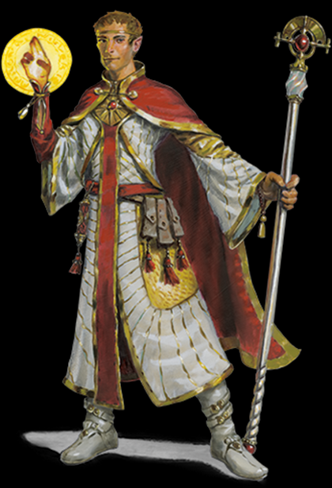
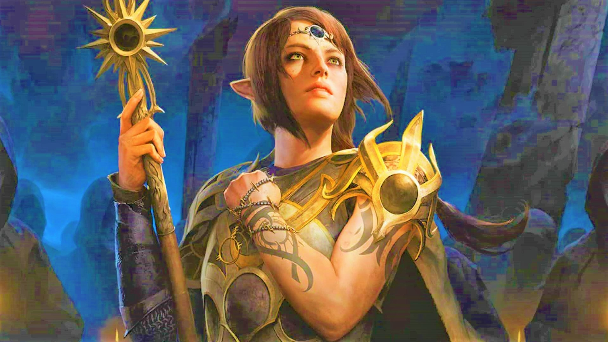

# Meio-Elfo
TRAÇOS RACIAIS DOS MEIO-ELFOS
Seu personagem meio-elfo possui algumas qualidades em
comum com os elfos e algumas são exclusivas dos meioelfos.

*Aumento no Valor de Habilidade*: Seu valor de
Carisma aumenta em 2 e outros dois valores de
habilidade, à sua escolha, aumentam em 1.

*Idade*: Meio-elfos atingem a maturidade ao mesmo
tempo que os humanos atingem a idade adulta, por volta
dos 20 anos. Eles vivem muito mais que os humanos, no
entanto, raramente ultrapassam os 180 anos.

    EXCELENTES EMBAIXADORES
    Muitos meio-elfos aprendem a lidar com todos, desde muito jovens, acabando 
    com hostilidade e encontrando interesses em comum. Como raça, eles possuem 
    a graça élfica sem possuir a indiferença élfica, e energia humana sem a grosseria humana.

    Geralmente, eles se tornam excelentes embaixadores e 
    intermediadores (exceto entre elfos e humanos, já que cada lado 
    tende a suspeitar que o meio-elfo possa estar favorecendo o outro lado).

*Tendência*: Meio-elfos compartilham a veia
caótica da sua herança élfica. Eles valorizam tanto a
sua liberdade quanto sua expressão criativa, não
demonstrando qualquer apresso por líderes ou seguidores.
Eles se irritam com regras, ressentindo com exigências de
outros e, as vezes, se provam incertos, ou pelo menos,
imprevisíveis.

*Tamanho*: Meio-elfos tem aproximadamente a mesma
altura dos humanos, variando entre 1,50 metro e 1,80
metro. Seu tamanho é Médio.

*Deslocamento*: Seu deslocamento base de caminhada
é 9 metros.

*Visão no Escuro*: Graças ao seu sangue élfico, você
tem uma visão superior no escuro e na penumbra. Você
enxerga na penumbra a até 18 metros como se fosse luz
plena, e no escuro como se fosse na penumbra. Você não
pode discernir cores no escuro, apenas tons de cinza.

*Ancestral Feérico*: Você possui vantagem em testes
de resistência contra encantamento e magia não pode
colocar você pra dormir.

*Versatilidade em Perícia*: Você ganha proficiência
em duas perícias, à sua escolha.

*Idiomas*: Você sabe falar, ler e escrever Comum,
Élfico e um idioma adicional, à sua escolha. 

  
  

