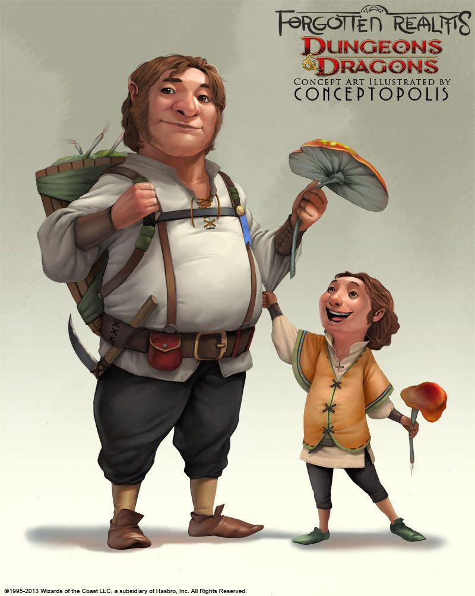

# Halfling

## TRAÇOS RACIAIS DOS HALFLINGS
Seu halfling possui uma série de características em
comum com todos os outros halflings.

*Aumento no Valor de Habilidade*: Seu valor de Destreza aumenta em 2.

*Idade*: Um halfling atinge a idade adulta aos 20 anos e pode chegar a 150 anos.

*Tendência*: A maioria dos halflings é leal e boa. Via de regra, eles possuem um bom coração e são amáveis, odeiam ver o sofrimento dos outros e não toleram a
opressão. Eles também são muito ordeiros e tradicionais, fortemente apegados à sua comunidade e ao conforto de suas antigas tradições.

*Tamanho*: Halflings medem cerca de 0,90 metro de altura e pesam aproximadamente 20 kg. Seu tamanho é Pequeno.

*Deslocamento*: Seu deslocamento base de caminhada é 7,5 metros.

*Sortudo*: Quando você obtiver um 1 natural em uma jogada de ataque, teste de habilidade ou teste de resistência, você pode jogar de novo o dado e deve utilizar
o novo resultado.

*Bravura*: Você tem vantagem em testes de resistência contra ficar amedrontado.

*Agilidade Halfling*: Você pode mover-se através do espaço de qualquer criatura que for de um tamanho maior que o seu.

*Idiomas*: Você pode falar, ler e escrever Comum e Halfling. A linguagem Halfling não é secreta, mas os halflings são relutantes em compartilhá-la com os outros.
Eles escrevem muito pouco, por isso eles não possuem uma literatura rica. No entanto, sua tradição oral é muito forte. Quase todos os halflings falam o idioma Comum para conversar com as pessoas das terras que habitam, ou através das quais eles estejam viajando.

*Sub-raça*: Os dois tipos principais de halflings, PésLeves e Robustos, são mais como famílias bem próximas do que verdadeiras sub-raças. Escolha uma destas subraças. 

### PÉS LEVES
Como um halfling pés-leves, você pode esconder-se facilmente, mesmo usando apenas outras pessoas como cobertura. Você geralmente é afável e se dá muito bem
com os outros. Nos Reinos Esquecidos, os halflings pésleves espalharam-se até os lugares mais distantes e são a variedade mais comum.

Pés-leves são mais propensos à vontade de viajar do que os outros halflings, e muitas vezes vivem ao lado de outras raças ou levam uma vida nômade. No mundo de
Greyhawk, estes halflings são chamados pés-peludos ou companheiros altos.

*Aumento no Valor de Habilidade*: Seu valor de Carisma aumenta em 1.

*Furtividade Natural*: Você pode tentar se esconder mesmo quando possuir apenas a cobertura de uma criatura que for no mínimo um tamanho maior que o seu.
  
  
  

### ROBUSTO
Um halfling robustos é mais resistente do que a média de sua raça e possui certa resistência aos venenos. Alguns dizem que os robustos têm sangue dos anões. Nos Reinos Esquecidos, esses halflings são chamados de austeros, e são mais comuns no sul.

*Aumento no Valor de Habilidade*: Seu valor de Constituição aumenta em 1.

*Resiliência dos Robustos*: Você tem vantagem em testes de resistência contra veneno e tem resistência contra dano de veneno. 

  
  
