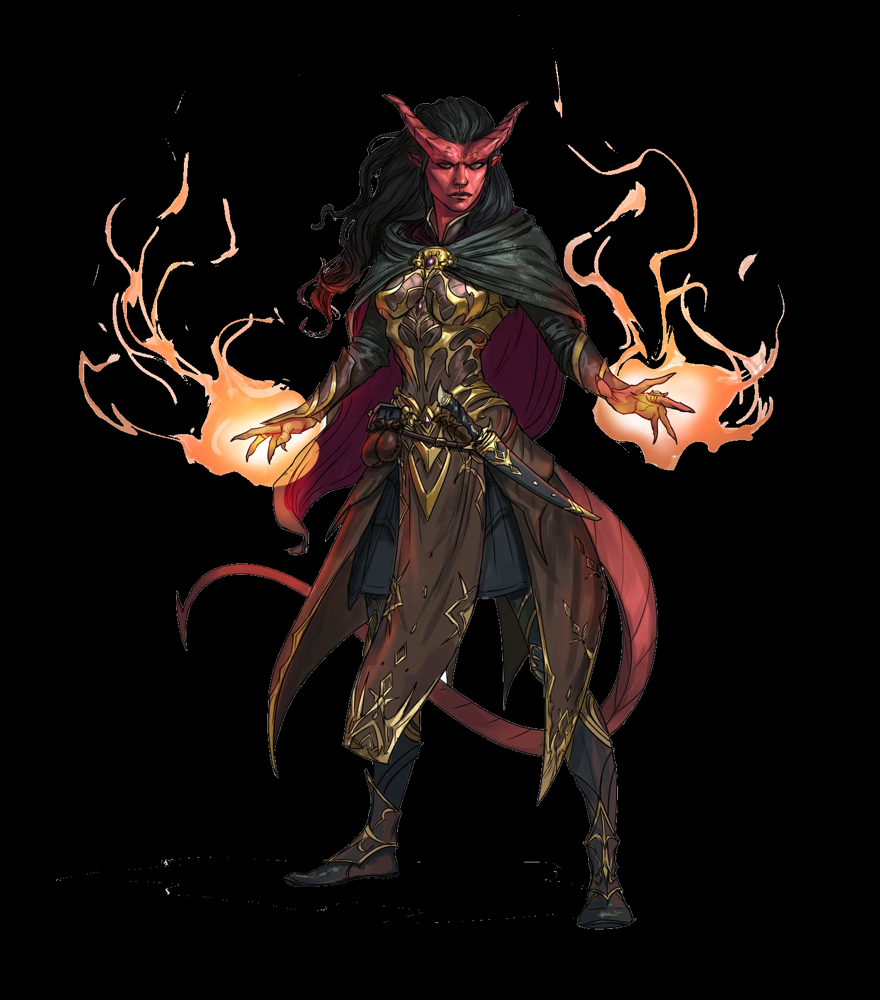
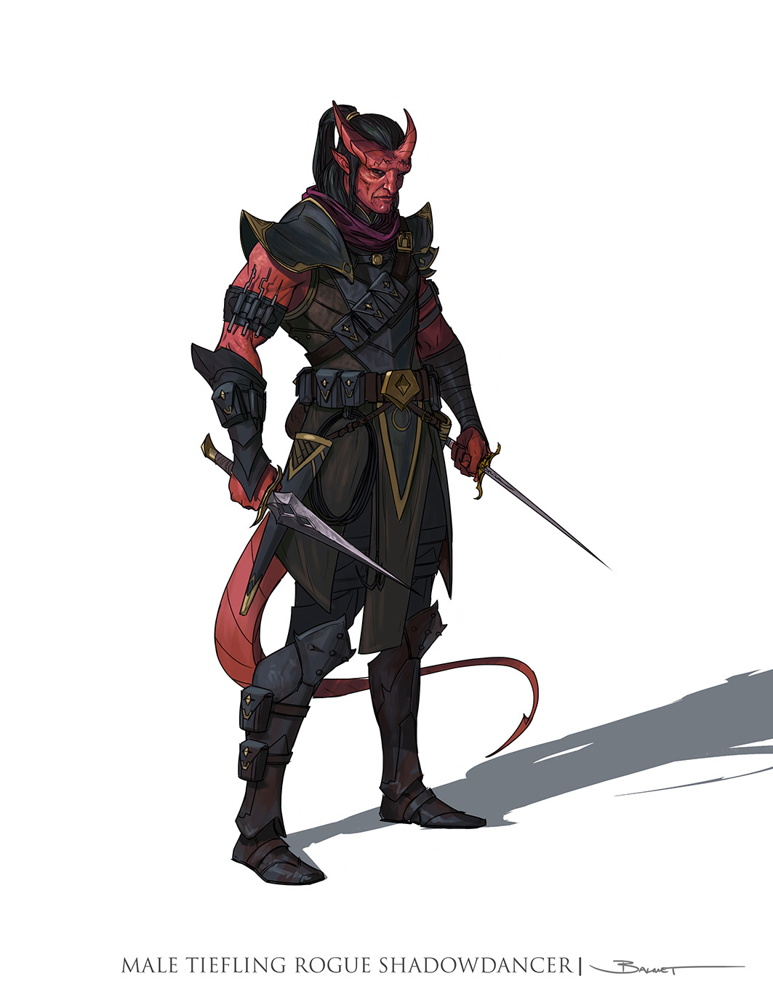

# Tiefling

Os tieflings compartilham certos traços raciais como
resultado de sua descendência infernal.

*Aumento no Valor de Habilidade*: Seu valor de
Inteligência aumenta em 1 e seu valor de Carisma
aumenta em 2.

    DESCONFIANÇA RECIPROCA
    As pessoas tendem a suspeitas dos tieflings, presumindo que sua herança infernal também deixou 
    marcas em sua personalidade e moral, não apenas em sua aparência. Vendedores mantem os olhos
    fixos em suas mercadorias quando tieflings entram em suas lojas, o guarda da torre da cidade 
    irá seguir um tiefling perambulando por um tempo e demagogos culpam os tieflings por 
    acontecimentos estranhos. A verdade, no entanto, é que a linhagem dos tieflings não define sua 
    personalidade de forma relevante. Anos lidando com suspeitas sim deixa marcas na maioria dos 
    tieflings, e eles respondem a isso de variadas formas.
    Alguns escolhem incorporar o estereótipo perverso, mas outros são virtuosos. A maioria está 
    simplesmente muito consciente de como as pessoas reagem a eles. Depois de lidar com essa 
    desconfiança na juventude, um tieflings muitas vezes desenvolve a capacidade de sobrepujar 
    o preconceito com charme ou intimidação.

*Idade*: Os tieflings amadurecem ao mesmo tempo que
os humanos, mas vivem alguns anos a mais.
Tendência. Tieflings não possuem uma tendência
inata ao mal, mas muitos acabam por abraçá-lo. Maligno
ou não, uma natureza independente inclina a maioria dos
tieflings ao alinhamento caótico.

*Tamanho*: Os tieflings possuem o mesmo tamanho e
compleição dos humanos. Seu tamanho é Médio.
Deslocamento. Seu deslocamento base de caminhada
é 9 metros.

*Visão no Escuro*: Graças a sua herança infernal, você
tem uma visão superior no escuro e na penumbra. Você
enxerga na penumbra a até 18 metros como se fosse luz
plena, e no escuro como se fosse na penumbra. Você não
pode discernir cores no escuro, apenas tons de cinza.
Resistência Infernal. Você possui resistência a dano
de fogo.

*Legado Infernal*: Você conhece o truque
taumaturgia. Quando você atingir o 3° nível, você poderá
conjurar a magia repreensão infernal como uma magia de
2° nível. Quando você atingir o 5° nível, você também
poderá conjurar a magia escuridão. Você precisa terminar
um descanso longo para poder usar as magias desse traço
novamente. Sua habilidade de conjuração para essas
magias é Carisma.

*Idiomas*: Você sabe falar, ler e escrever Comum e
Infernal. 
  
  
